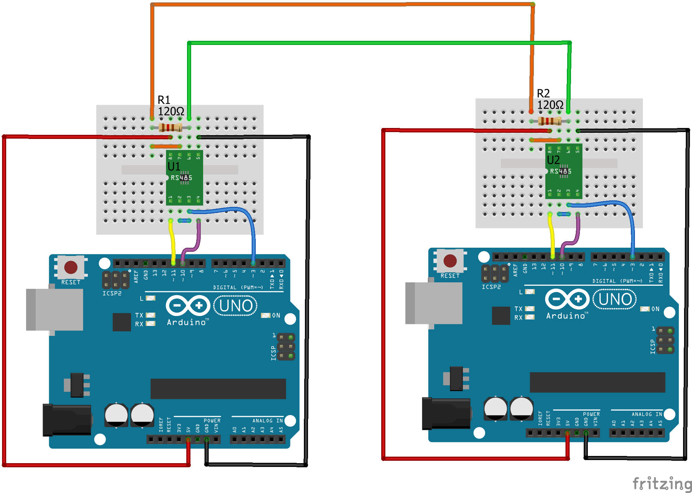

# Transmission / Reception sur un bus RS485

Communication sur bus RS485 entre deux ou plusieurs carte Arduino :
 - 1 maitre           : RS485_Master.ino
 - esclaves (1 à 29)  : RS485_Slave.ino
 
## Connexion :

## Module :

Convertisseur TTL <-> RS485 Velleman MM107
[https://www.velleman.eu/products/view/?id=431912&country=us&lang=fr](https://www.velleman.eu/products/view/?id=431912&country=us&lang=fr)

